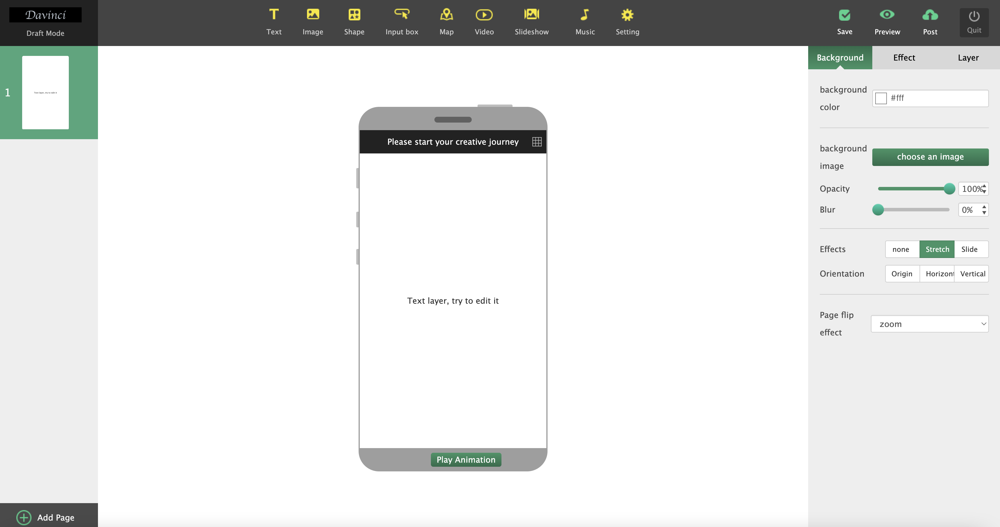

After leaving my first startup at the beginning of 2014, my family fully supported me to start my second business as a Founder. I returned to Beijing.

After returning to Beijing in February, we were lucky enough to meet one of our clients who was planning to make a microfilm called Extreme Youth, and had a great need for collaborative design software  https://github.com/central-perk/DaVinci, so from February to March, we fell headlong into communication with their team.

That's how ECD was born, because I really like the American drama "Friends", so my organization is called Central Perk,  [https://github.com/central-perk](https://github.com/central-perk)

